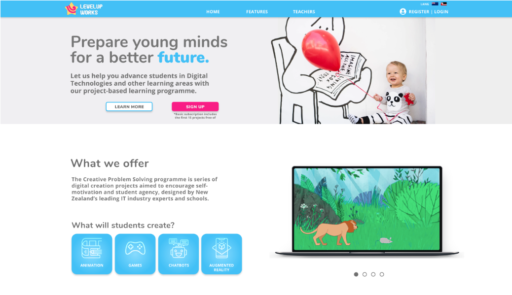

<a name="readme-top"></a>

<!-- PROJECT LOGO -->
<br />
<div align="center">


<!-- PROJECT SHIELDS -->

[![Contributors][contributors-shield]][contributors-url]

[![GitHub - Luis Rodríguez][Github.logo]][luis-github-url] [![GitHub - Kelsie Smith][Github.logo]][kelsie-github-url]

Luis Rodríguez | Kelsie Smith

  <a href="https://github.com/WeisshorNz/L5-Mission4">
  
  </a>
<h3 align="center">LevelUp Works LMS: A React-based Learning Management System for delivering digital tech curriculum in schools seamlessly.</h3>

  <p align="center">
   In this project, we build the frontend, backend and database for "LevelUp Works",a company dedicated to delivering top-notch educational technologies to primary and intermediate schools. This repository hosts the prototype for this project: a robust educational technology platform built with React, Node.js, and MySQL. 
    <br />
    <a href="https://github.com/WeisshorNz/L5-Mission4"><strong>Explore the docs »</strong></a>

  </p>
</div>

<!-- TABLE OF CONTENTS -->
<details>
  <summary>Table of Contents</summary>
  <ol>
    <li>
      <a href="#about-the-project">About The Project</a>
      <ul>
        <li><a href="#built-with">Built With</a></li>
      </ul>
    </li>
    <li>
      <a href="#getting-started">Getting Started</a>
      <ul>
        <li><a href="#prerequisites">Prerequisites</a></li>
        <li><a href="#installation">Installation</a></li>
      </ul>
    </li>
    <li><a href="#contact">Contact</a></li>
    <li><a href="#acknowledgments">Acknowledgments</a></li>
  </ol>
</details>

<!-- ABOUT THE PROJECT -->

## About The Project

<!--  -->

<p align="right">(<a href="#readme-top">back to top</a>)</p>

### Built With

- [![MySQL][MySQL.logo]][MySQL-url]
- [![Node.js][Node.js.logo]][Nodejs-url]
- [![React][React.js]][React-url]

<p align="right">(<a href="#readme-top">back to top</a>)</p>

<!-- GETTING STARTED -->

## Getting Started

### Prerequisites

Before diving into the application, ensure:

Node.js and npm are installed on your machine.
You have a MySQL setup or access to a MySQL database.

### Installation

1. Require the API Key with permission from luis@missionreadyhq.com
2. Clone the repo
   ```sh
   git clone https://github.com/WeisshorNz/Levelup-Education-Suite
   ```
3. Install NPM packages from both backend and frontend folders
   ```sh
   npm install
   ```
4. Update your .env file with appropriate configurations (e.g., database credentials, API keys).
5. Open backend folder in terminal and run start script
   ```sh
   npm run start
   ```
6. Open frontend folder in terminal and run start script
   ```sh
   npm run start
   ```

<p align="right">(<a href="#readme-top">back to top</a>)</p>

<!-- CONTACT -->

## Contact

Luis Rodríguez - luis@missionreadyhq.com
<br></br><br></br>
Kelsie Smith - kelsieS@missionreadyhq.com

- [![LinkedIn - Kelsie Smith][linkedin-shield]][kelsie-linkedin-url]
  <br></br>
  <br></br>
  Project Link: [https://github.com/WeisshorNz/L5-Mission4](https://github.com/WeisshorNz/L5-Mission4)

<p align="right">(<a href="#readme-top">back to top</a>)</p>

<!-- ACKNOWLEDGMENTS -->

## Acknowledgments

- [Best README Template](https://github.com/othneildrew/Best-README-Template/tree/master)

<p align="right">(<a href="#readme-top">back to top</a>)</p>

<!-- MARKDOWN LINKS & IMAGES -->

[contributors-shield]: https://img.shields.io/github/contributors/WeisshorNz/L5-Mission2.svg?style=for-the-badge
[contributors-url]: https://github.com/WeisshorNz/L5-Mission2/graphs/contributors
[linkedin-shield]: https://img.shields.io/badge/-LinkedIn-black.svg?style=for-the-badge&logo=linkedin&colorB=555
[Github.logo]: https://img.shields.io/badge/GitHub-100000?style=for-the-badge&logo=github&logoColor=white
[luis-github-url]: https://github.com/WeisshorNz
[kelsie-github-url]: https://github.com/KelsieSmitty
[kelsie-linkedin-url]: https://www.linkedin.com/in/kelsieSmitty/
[product-screenshot]: images/screenshot.png
[React.js]: https://img.shields.io/badge/React-20232A?style=for-the-badge&logo=react&logoColor=61DAFB
[React-url]: https://reactjs.org/
[Nodejs-url]: https://nodejs.org/en
[Node.js.logo]: https://img.shields.io/badge/Node.js-43853D?style=for-the-badge&logo=node.js&logoColor=white
[Azure-url]: https://azure.microsoft.com/en-us
[Azure.logo]: https://img.shields.io/badge/Azure-0078D4?style=for-the-badge&logo=microsoftazure&logoColor=white
[MongoDB-url]: https://www.mongodb.com/
[MongoDB.logo]: https://img.shields.io/badge/MongoDB-4EA94B?style=for-the-badge&logo=mongodb&logoColor=white
[MySQL.logo]: https://img.shields.io/badge/MySQL-4479A1?style=for-the-badge&logo=mysql&logoColor=white
[MySQL-url]: https://www.mysql.com/
